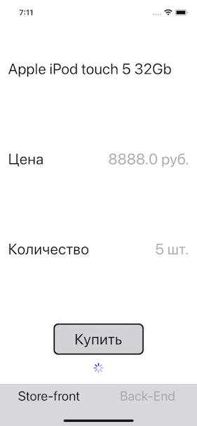
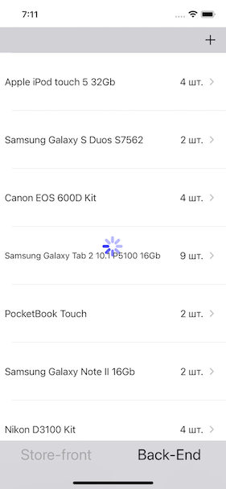

# FunboxTestTask
test task from Funbox

 [Test task](/qt-ios-android.pdf) for the vacancy of ios developer at [funbox](https://funbox.ru/vacancies/mobile-developer). The project is educational.

## App description

The app contains three screen:

1.  Store-front screen - shows product information and a buy button.
2.  Back-End screen - shows a table with product name and amount. Screen has a button for adding a new product and editing an existing product.
3.  Add/edit product screen - the screen has fields for editing a product and buttons for canceling and saving. 

**screenshots app:** 

![store-front screen][image1] ![back-end screen][image2] ![add/edit screen][image3]

[image1]: screenshots/store-front.png
[image2]: screenshots/back-end.png
[image3]: screenshots/addEdit.png

## Tasks
description of tasks implementation
### Task 1
the app is split in two using [UITabBarController](/Funbox/Controllers/MainTabBarViewController.swift).
- store-front - implemented [UIPageViewController](/Funbox/Controllers/StorePageViewController.swift) with content [page](/Funbox/Controllers/StoreFrontContentViewController.swift) view.
- back-end - implemented [UITableViewController](Funbox/Controllers/BackEndViewController.swift) wrapped from UINavigationController
- add/edit screen - implemented [UIViewController](/Funbox/Controllers/DetailViewController.swift) with [view](Funbox/Views/DetailDeviceView.swift)
- [work with data](Funbox/Service/DeviceProvider.swift)

### Task 2
test data are in [StaticArrayData](Funbox/Service/StaticArrayData.swift)

adapter example [StorageJSON](Funbox/Service/StorageJSON.swift)

storage replacement example:
~~~swift
//test data
let storageDevices: StorageProtocol = StaticArrayData()

///example of working with the adapter.
//let storageDevices: StorageProtocol = StorageJSONAdapter(storage: StorageJSON())

let deviceProvider = DeviceProvider(storage: storageDevices)
~~~     
        
### Task 3

Used DispatchQueue with a Barrier flag. 

An UIActivityIndicatorView has been added to show that a buy and update operation has started.

screenshots: 

## Received knowledge
- UIKit
  - UIPageViewController
  - UITabBarController
  - UINavigationController
  - UIStackView
  - UIActivityIndicatorView
- Pattern
  - Adapter
- Multithreading
  - DispatchQueue
  - Barrier